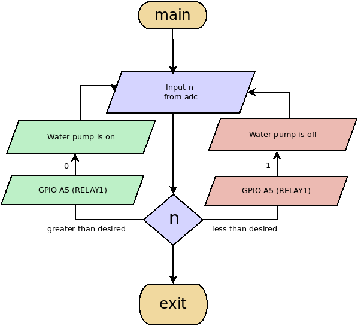

## Automated plant watering system

### Hardware
- stm32f103c8t6 mcu
- 5V relay module or transistor
- 3.3V water pump
- arduino soil moisture sensor

### Description
- reads moisture level thru adc1
- if moisture level is below threshold, turn on the pump else turn it off
- uses uart to send debug messages to the terminal

### Dependencies
- arm-none-eabi-gcc
- st-flash
- libopencm3
- rtos

### Buidling
``` bash

. /opt/gcc-arm-none-eabi-7-2018-q2-update/environments
make clobber 
make

```

